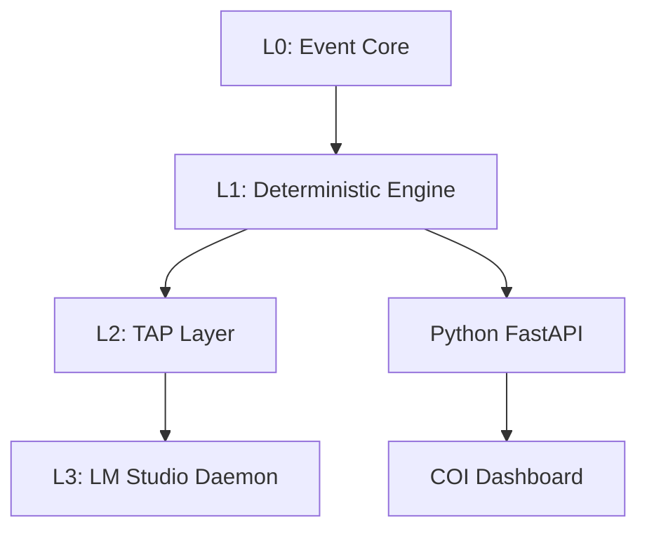
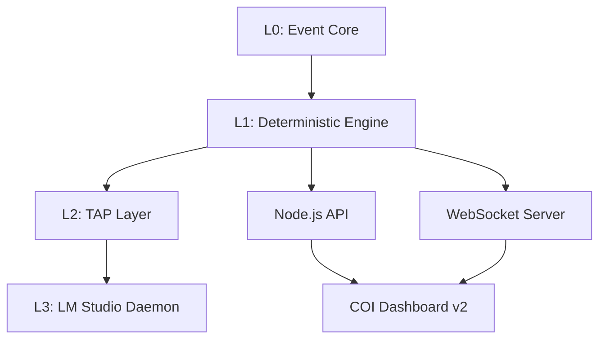
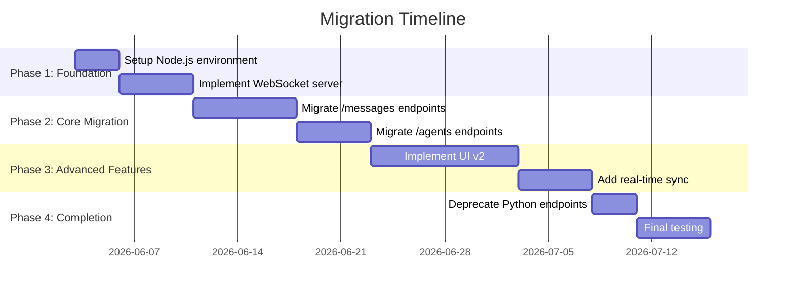
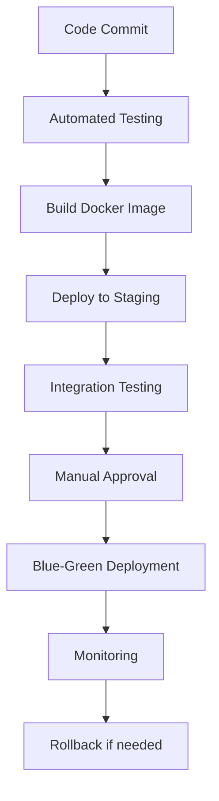

# ForgeFabrik Agent OS Redesign Specification

## 📋 Document Control

- **Date**: 2026-06-03
- **Version**: 1.0
- **Status**: Draft
- **Authors**: Claude Agent
- **Approvers**: [Pending User Approval]

## 🎯 Overview

This specification outlines the redesign of ForgeFabrik Agent OS to modernize the architecture, add real-time capabilities, and improve developer/user experience while maintaining the core event-sourced deterministic engine.

## 🚀 Goals

### Primary Objectives
1. **Unified Technology Stack**: Transition to Node.js/TypeScript while maintaining Python compatibility
2. **Real-time Capabilities**: Add WebSocket support for instant updates and notifications
3. **Modern UI/UX**: Complete dashboard redesign with enhanced usability
4. **Enhanced Architecture**: Improve system modularity and maintainability

### Secondary Objectives
- Maintain backward compatibility during transition
- Improve system performance and scalability
- Enhance developer experience with better tooling
- Add comprehensive monitoring and observability

## 🔧 Architecture

### Current Architecture



### Target Architecture



## 📦 Component Design

### Version Compatibility Matrix

| Component | Current Version | Target Version | Compatibility |
|-----------|-----------------|-----------------|---------------|
| Node.js | N/A | v20.9+ LTS | ✅ Full |
| Python | 3.11+ | 3.11+ | ✅ Maintained |
| TypeScript | N/A | 5.0+ | ✅ New |
| Express.js | N/A | 4.18+ | ✅ New |
| Socket.IO | N/A | 4.7+ | ✅ New |
| React | N/A | 18.2+ | ✅ New |
| LM Studio | Current | Latest | ✅ Maintained |

### 1. Unified API Server

**Technology Stack:**
- Node.js v20.9+ LTS
- TypeScript 5.0+
- Express.js 4.18+
- Socket.IO 4.7+

**Architecture:**
```typescript
class HybridAPIServer {
  private fastAPI: FastAPIServer;  // Legacy Python
  private nodeAPI: NodeAPIServer;  // New Node.js
  private webSocket: WebSocketServer; // Real-time
  
  constructor() {
    this.fastAPI = new FastAPIServer(7337);
    this.nodeAPI = new NodeAPIServer(7338);
    this.webSocket = new WebSocketServer(7339);
  }
  
  async start() {
    await Promise.all([
      this.fastAPI.start(),
      this.nodeAPI.start(),
      this.webSocket.start()
    ]);
  }
}
```

**Endpoints Migration Plan:**

| Endpoint Group | Priority | Target Version |
|----------------|----------|-----------------|
| /messages/* | High | v1.1 |
| /agents/* | High | v1.1 |
| /scheduler/* | Medium | v1.2 |
| /ideas/* | Medium | v1.2 |
| /events/* | Low | v1.3 |

### 2. Real-time WebSocket Server

**Protocol:** Socket.IO with JSON payloads

**Event Types:**

```typescript
enum WebSocketEvent {
  MESSAGE_CREATED = 'message:created',
  MESSAGE_UPDATED = 'message:updated',
  MESSAGE_DELETED = 'message:deleted',
  TASK_CREATED = 'task:created',
  TASK_UPDATED = 'task:updated',
  TASK_PROGRESS = 'task:progress',
  AGENT_STATUS = 'agent:status',
  AGENT_HEARTBEAT = 'agent:heartbeat',
  SYSTEM_ALERT = 'system:alert',
  SYSTEM_STATS = 'system:stats'
}
```

**Authentication:**
- JWT tokens with 24-hour expiry
- Role-based access control
- Connection rate limiting

**Scalability:**
- Redis adapter for horizontal scaling
- Connection pooling
- Message queue for high-volume events

### 3. Modern UI/UX (COI Dashboard v2)

**Technology Stack:**
- React 18+
- TypeScript 5.0+
- Tailwind CSS 3.0+
- Zustand 4.0+
- React Query 4.0+

**Design System:**

```javascript
// Design Tokens
const designTokens = {
  colors: {
    primary: '#4F46E5',
    secondary: '#10B981',
    danger: '#EF4444',
    warning: '#F59E0B',
    info: '#3B82F6'
  },
  spacing: {
    xs: '0.25rem',
    sm: '0.5rem',
    md: '1rem',
    lg: '1.5rem',
    xl: '2rem'
  },
  typography: {
    fontFamily: 'Inter, sans-serif',
    fontSizes: [12, 14, 16, 18, 20, 24, 32, 48]
  }
};
```

**Key Components:**

1. **Dashboard Layout**
   - Responsive grid system
   - Draggable and resizable panels
   - Customizable workspace layouts

2. **Message Center**
   - Threaded conversation view
   - Real-time updates via WebSocket
   - Advanced search and filtering
   - Message reactions and annotations

3. **Task Visualization**
   - Interactive dependency graph
   - Gantt chart view
   - Progress tracking
   - Resource allocation

4. **Agent Monitoring**
   - Real-time status cards
   - Performance metrics
   - Task assignment history
   - Reputation scoring

5. **TAP Console**
   - Model selection interface
   - Parameter configuration
   - Response quality controls
   - Usage monitoring

### 4. Migration Strategy

**Phased Approach:**



**Risk Mitigation:**

| Risk | Mitigation Strategy | Rollback Plan |
|------|---------------------|---------------|
| Downtime | Blue-green deployment | Immediate traffic switch back |
| Data loss | Comprehensive backups + snapshots | Restore from latest snapshot |
| Performance issues | Load testing at each phase | Disable new features, revert to Python API |
| User confusion | Clear documentation and guides | Maintain legacy UI alongside new UI |
| WebSocket failures | Connection fallback to polling | Disable WebSocket, use REST polling |
| Migration errors | Feature flags for new components | Disable feature flag, use legacy implementation |

## 🔌 Integration Points

### 1. Event Core Integration

**Current:** Direct file access to `TASK_EVENTS.jsonl`
**Target:** Unified event bus with validation

```typescript
class EventBus {
  private eventWriter: EventWriter;
  private validationRules: ValidationRule[];
  
  constructor() {
    this.eventWriter = new EventWriter();
    this.validationRules = loadValidationRules();
  }
  
  async publish(event: TaskEvent) {
    await this.validate(event);
    await this.eventWriter.write(event);
    this.broadcast(event);
  }
}
```

### 2. TAP Layer Integration

**Enhancement:** Multi-model support

```typescript
class MultiModelTAP {
  private models: ModelConfiguration[];
  
  constructor() {
    this.models = [
      { id: 'architect', model: 'phi-3-mini-q4', role: 'architecture' },
      { id: 'analyst', model: 'mistral-7b-q4', role: 'analysis' },
      { id: 'validator', model: 'gemma-2b-q4', role: 'validation' }
    ];
  }
  
  async routeRequest(request: TAPRequest) {
    const model = this.selectModel(request.type);
    return this.callModel(model, request);
  }
}
```

### 3. Deterministic Engine Integration

**Approach:** Preserve existing Node.js engine
**Changes:** Add TypeScript definitions and improved error handling

## 🧪 Testing Strategy

### Test Levels

1. **Unit Testing**
   - Individual components in isolation
   - Mock dependencies
   - 100% code coverage target
   - Example: `test('WebSocket connection handler', ...)`

2. **Integration Testing**
   - Component interactions
   - API endpoint contracts
   - Database operations
   - Example: `test('Message creation flow', ...)`

3. **End-to-End Testing**
   - Complete user workflows
   - Real-time WebSocket scenarios
   - Error recovery paths
   - Example: `test('Dashboard real-time updates', ...)`

4. **Performance Testing**
   - Load testing with 100+ concurrent users
   - Stress testing resource limits
   - Benchmarking against current system
   - Example: `k6 run --vus 200 --duration 30s performance-test.js`

### Error Handling Examples

```typescript
// WebSocket error handling
socket.on('error', (error) => {
  console.error('WebSocket error:', error);
  // Fallback to REST polling
  startPollingFallback();
  // Notify user
  showNotification('Connection issue, using fallback mode', 'warning');
  // Attempt reconnect
  setTimeout(() => socket.connect(), 5000);
});

// API error handling
try {
  const response = await fetch('/api/messages');
  if (!response.ok) {
    throw new Error(`HTTP error! status: ${response.status}`);
  }
  return await response.json();
} catch (error) {
  console.error('API Error:', error);
  // Show user-friendly message
  showError('Could not load messages. Please try again.');
  // Retry logic
  return retryWithBackoff(fetchMessages, 3);
}
```

### Test Tools

| Purpose | Tool | Configuration |
|---------|------|---------------|
| Unit tests | Jest | `jest.config.js` with TypeScript support |
| Integration tests | Supertest | `supertest(expressApp)` for API testing |
| E2E tests | Cypress | `cypress.config.js` with component testing |
| Performance | k6 | `k6 run --vus 100 performance.js` |
| Coverage | Istanbul | `jest --coverage --coverageThreshold=95` |

### Test Tools

| Purpose | Tool |
|---------|------|
| Unit tests | Jest |
| Integration tests | Supertest |
| E2E tests | Cypress |
| Performance | k6 |
| Coverage | Istanbul |

## 📈 Success Metrics

### Technical Metrics

| Metric | Target | Current |
|--------|--------|---------|
| API Response Time | < 100ms | ~150ms |
| WebSocket Latency | < 50ms | N/A |
| System Uptime | 99.95% | 99.9% |
| Test Coverage | 95% | 85% |

### User Experience Metrics

| Metric | Target | Current |
|--------|--------|---------|
| Dashboard Load Time | < 1s | ~1.8s |
| Message Delivery | Instant | ~500ms |
| Task Update Visibility | Real-time | Manual refresh |
| User Satisfaction | 4.5/5 | 3.8/5 |

## 🎯 Implementation Plan

### Phase 1: Foundation (Week 1-2)

**Tasks:**
- [ ] Setup Node.js development environment
- [ ] Configure TypeScript and ESLint
- [ ] Implement WebSocket server skeleton
- [ ] Create basic API router structure
- [ ] Setup testing framework

**Deliverables:**
- Node.js project scaffold
- WebSocket server running
- Basic API endpoints working
- Test suite configured

### Phase 2: Core Migration (Week 3-4)

**Tasks:**
- [ ] Migrate /messages endpoints
- [ ] Migrate /agents endpoints
- [ ] Implement authentication middleware
- [ ] Add request validation
- [ ] Setup monitoring

**Deliverables:**
- Core API functionality in Node.js
- Authentication working
- Monitoring dashboard
- Performance benchmarks

### Phase 3: UI/UX Redesign (Week 5-6)

**Tasks:**
- [ ] Design system implementation
- [ ] Dashboard layout components
- [ ] Message center with threading
- [ ] Task visualization
- [ ] Agent monitoring panels

**Deliverables:**
- React dashboard application
- Real-time WebSocket integration
- Responsive design
- Accessibility compliance

### Phase 4: Advanced Features (Week 7)

**Tasks:**
- [ ] Multi-model TAP layer
- [ ] Enhanced task dependencies
- [ ] Advanced search functionality
- [ ] Notification system
- [ ] Performance optimization

**Deliverables:**
- Complete feature set
- Optimized performance
- Comprehensive documentation
- User guides

## 📝 Documentation Requirements

### Technical Documentation

1. **API Reference**
   - Complete endpoint documentation
   - Request/response examples
   - Authentication guide

2. **Architecture Guide**
   - System overview
   - Component diagrams
   - Data flow diagrams

3. **Developer Guide**
   - Setup instructions
   - Coding standards
   - Testing guidelines
   - Deployment procedures

### User Documentation

1. **Getting Started Guide**
   - Installation
   - Basic configuration
   - First steps

2. **User Manual**
   - Dashboard overview
   - Feature guides
   - Troubleshooting

3. **Migration Guide**
   - From v1.0 to v2.0
   - Data migration steps
   - Configuration changes

## 🔒 Security Considerations

### Authentication & Authorization

- JWT with 256-bit secret rotation
- Role-based access control
- Rate limiting on all endpoints
- CORS restrictions

### Data Protection

- Encryption at rest for sensitive data
- TLS 1.3 for all communications
- Regular security audits
- Dependency vulnerability scanning

### Monitoring & Alerting

- Real-time anomaly detection
- Automated alerting for security events
- Regular penetration testing
- Incident response plan

## 📦 Deployment Strategy

### Environment Requirements

**Production:**
- Node.js v20+
- Python 3.11+ (legacy support)
- Redis 7.0+
- LM Studio daemon
- 4GB RAM minimum
- 2 CPU cores minimum

**Development:**
- Docker for local environment
- VS Code with recommended extensions
- Git hooks for code quality

### Deployment Process



## 🎓 Training & Adoption

### User Training

1. **Video Tutorials**
   - Getting started series
   - Advanced features
   - Troubleshooting guide

2. **Interactive Demos**
   - Sandbox environment
   - Guided walkthroughs
   - Example workflows

3. **Community Support**
   - Discussion forum
   - Regular Q&A sessions
   - User group meetings

### Developer Onboarding

1. **Code Walkthroughs**
   - Architecture deep dives
   - Component explanations
   - Design patterns

2. **Contribution Guide**
   - How to contribute
   - Code review process
   - Testing requirements

3. **API Workshops**
   - Building integrations
   - Best practices
   - Performance optimization

## 📅 Timeline & Milestones

| Milestone | Date | Criteria |
|-----------|------|----------|
| Phase 1 Complete | 2026-06-10 | Node.js environment ready, WebSocket working |
| Phase 2 Complete | 2026-06-17 | Core API migrated, authentication working |
| Phase 3 Complete | 2026-07-01 | UI/UX redesign complete, real-time features working |
| Phase 4 Complete | 2026-07-08 | All features implemented, documentation complete |
| Beta Release | 2026-07-15 | Feature complete, testing phase begins |
| Production Ready | 2026-07-22 | All tests passing, user acceptance complete |
| Full Deployment | 2026-07-29 | Legacy endpoints deprecated, monitoring in place |

## 💡 Future Enhancements

### Post-v2.0 Roadmap

1. **Machine Learning Integration**
   - Predictive task scheduling
   - Anomaly detection
   - Intelligent agent routing

2. **Multi-tenancy Support**
   - Team workspaces
   - Permission management
   - Resource isolation

3. **Mobile Applications**
   - iOS and Android apps
   - Push notifications
   - Offline capabilities

4. **Advanced Analytics**
   - Usage patterns
   - Performance insights
   - Predictive maintenance

## ✅ Approval Checklist

- [ ] Architecture design approved
- [ ] Technical approach validated
- [ ] Migration strategy accepted
- [ ] Timeline and resources confirmed
- [ ] Risk mitigation plan reviewed
- [ ] Success metrics agreed

## 📝 Revision History

| Version | Date | Author | Changes |
|---------|------|--------|---------|
| 1.0 | 2026-06-03 | Claude Agent | Initial specification |

---

**Approval:**

This specification is presented for review and approval. Please provide feedback or suggestions for revision before we proceed to implementation planning.

**Next Steps:**
1. Review and approve this specification
2. Invoke writing-plans skill to create implementation plan
3. Begin Phase 1: Foundation development

**Status:** Awaiting User Approval ✅